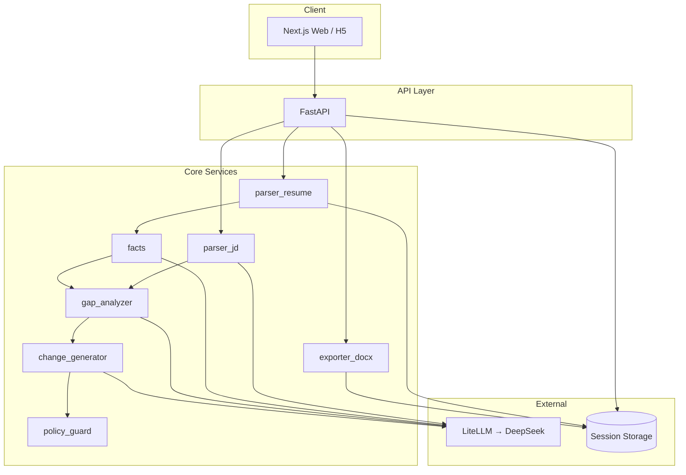
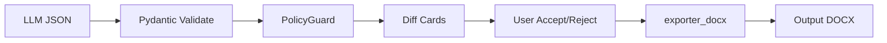

# CV-Doctor 架构说明

> 与 [P0 MVP 实施方案](./p0-mvp-implementation.md) 对齐；长期演进见 [PLAN.md](../PLAN.md)。

最后更新：2026-06-01

---

## 1. 系统定位

CV-Doctor 是 **Web 优先的简历手术台**：用户上传简历（DOCX）并粘贴岗位 JD，系统返回可审阅的匹配诊断与有限条数的修改建议（diff），用户逐条接受/拒绝/编辑后导出 DOCX。

**不是：** 简历生成器、通用润色工具、ATS 刷分器、自动投递平台。  
**是：** 有证据链、有风险提示、不编造经历的岗位匹配修改助手。

---

## 2. 架构原则

| 原则 | 说明 |
|------|------|
| 可审计 | 每处修改展示原文、改文、依据、风险 |
| 反幻觉 | 无证据不写进建议；PolicyGuard 硬过滤；高风险需确认 |
| 会话隔离 | P0 免登录 `session_id`；文件与元数据可删除 |
| 同步 Pipeline | P0 串行执行，目标首屏 ≤45s；异步队列留 P0.5 |
| 模型可换 | LiteLLM 统一接入，默认 DeepSeek V4 Flash |

---

## 3. 逻辑架构（C4 简化）



---

## 4. 仓库与部署单元

```text
cv-doctor/
├── web/                 # 前端：落地、结果、隐私页
├── server/              # 后端：API + Pipeline + 领域模型
├── cli/                 # 内部调试（Typer），非 P0 用户入口
├── docs/                # 架构、贡献、P0 方案、fixtures
├── skills/              # 可安装到 ~/.cursor/skills 的通用技能
├── .cursor/rules/       # Cursor 项目规则（行为 + 领域）
├── CLAUDE.md / AGENTS.md # Agent 执行标准
└── PLAN.md              # 产品路线图
```

| 部署单元 | P0（全 Cloudflare） |
|----------|-------------------|
| 前端 | Cloudflare **Pages**（`web/`） |
| 边缘 API | **Worker**（`worker/`） |
| 流水线 | **Container**（`server/`） |
| 存储 | **R2** + **D1** |

详见 [p0-cloudflare-stack.md](./p0-cloudflare-stack.md)。

---

## 5. 用户旅程与 API

### 5.1 旅程

```text
上传 DOCX + 粘贴 JD
  → POST /api/v1/sessions
  → 轮询 GET /api/v1/sessions/{id}
  → 展示 DiagnosisResult（五段式 UI）
  → PATCH changes 状态
  → POST export → 下载 DOCX
  → 可选 DELETE 会话
```

### 5.2 API 一览（P0）

| 方法 | 路径 | 职责 |
|------|------|------|
| `POST` | `/api/v1/sessions` | 创建会话：`multipart` resume + `jd_text` |
| `GET` | `/api/v1/sessions/{id}` | `pending` / `processing` / `done` / `failed` + 结果 |
| `PATCH` | `/api/v1/sessions/{id}/changes` | 更新每条 `Change`：`accepted` / `rejected` / `edited` |
| `POST` | `/api/v1/sessions/{id}/export` | 返回 DOCX 字节流 |
| `DELETE` | `/api/v1/sessions/{id}` | 删除会话与文件 |
| `GET` | `/health` | 健康检查 |

OpenAPI 建议在 P0 Phase 0 产出：`server/src/api/schemas.py`（见实施方案）。

---

## 6. 诊断 Pipeline

```text
SessionCreate(resume_file, jd_text)
  → parse_resume      → Resume + raw_text + 结构化段落
  → parse_jd          → JobDescription（LLM JSON）
  → extract_facts     → EvidenceStore（来自简历，可扩展用户输入）
  → gap_analyze       → requirements[] + MatchScore + jd_summary
  → generate_changes  → ChangeSet（如 5 条，UI 免费展示 3 条）
  → policy_filter     → 剔除 forbidden / 标记需确认
  → DiagnosisResult
```

**P0 不做：** 公司研究（天眼查/官网）、向量检索（可用关键词代替）、Kimi 深度报告。

### 6.1 LLM 调用预算（每会话约 4 次）

| 步骤 | 温度 | 输出 |
|------|------|------|
| JD 结构化 | 0.1 | `JobDescription` |
| 简历 Fact 抽取 | 0.1 | `list[Fact]` |
| Gap + JD 摘要 | 0.2 | 结构化 gap + 大白话 |
| Change 生成 | 0.3 | `ChangeSet` |

所有响应经 **Pydantic 校验**；失败重试；不向 UI 返回未校验 JSON。

---

## 7. 领域模型（代码真源）

核心类型定义在 [`server/src/models.py`](../server/src/models.py)：

| 类型 | 职责 |
|------|------|
| `Fact` / `EvidenceStore` | 可引用证据 |
| `JobRequirement` | JD 条目 + `MatchLevel` |
| `Change` | 单条修改建议（原文/改文/依据/风险/证据 id） |
| `PolicyGuard` | 规则 → `ALLOWED` / `NEEDS_CONFIRMATION` / `FORBIDDEN` |
| `MatchScore` | 加权匹配分（反馈用，非首屏核心） |
| `GapReport` / `ChangeSet` | 聚合结果 |

**禁止** 在业务逻辑中平行定义一套重复 DTO；API 层只做序列化与裁剪。

---

## 8. 信任与安全架构



| 关卡 | 规则 |
|------|------|
| 生成 | 无 `evidence_ids` 的建议不进入列表 |
| 策略 | `FORBIDDEN` 永不展示或导出 |
| 风险 | `HIGH` 必须 `requires_user_confirmation` |
| 导出 | 仅 `status == accepted` 的 Change |
| 隐私 | 24h TTL、一键删除、不上传用于训练（文案承诺） |

详见 Cursor 规则 `llm-trust-boundary.mdc` 与根目录 `CLAUDE.md`。

---

## 9. 前端信息架构（结果页）

顺序固定（与产品 v3.2 一致）：

1. 这个岗位在招什么人？（`jd_summary`）
2. 已匹配（`full`）
3. 部分匹配（`partial`）
4. 缺失（`missing`，仅建议补充，不写入简历）
5. 简历手术建议（≤3 条免费 diff）
6. Match Score（次要反馈条）

组件映射见实施方案：`GapSections.tsx`、`DiffCard.tsx`。

---

## 10. 目标目录结构（P0 实现态）

```text
server/src/
  main.py
  models.py
  api/routes/sessions.py
  services/
    parser_resume.py
    parser_jd.py
    facts.py
    gap_analyzer.py
    change_generator.py
    policy_guard.py
    exporter_docx.py
  llm/client.py
  storage/session_files.py

web/
  app/page.tsx
  app/s/[id]/page.tsx
  app/privacy/page.tsx
  components/UploadZone.tsx
  components/JdPaste.tsx
  components/GapSections.tsx
  components/DiffCard.tsx
  lib/api.ts
```

当前仓库可能尚未包含全部文件；以 [p0-mvp-implementation.md](./p0-mvp-implementation.md) 里程碑为准补齐。

---

## 11. 测试与质量门禁

| 层级 | 内容 |
|------|------|
| 单元 | parser、policy_guard、match_score 公式、models 边界 |
| 集成 | mock LLM 的 Pipeline schema 快照 |
| 人工 | 中文 JD、无证据改写、导出 DOCX、删除会话 |

发版前清单见 P0 文档 §7.3。

---

## 12. 演进路线（非 P0）

| 阶段 | 架构增量 |
|------|----------|
| P1 Target Mode | 公司研究服务、JD URL 抓取、证据库扩展 |
| P1.5 | Redis + Worker、异步诊断、SSE 进度 |
| P2 | 用户账号、多 JD、付费导出 |
| P3 | Kimi 报告、Ollama、CLI 增强 |

---

## 13. 相关文档

| 文档 | 用途 |
|------|------|
| [p0-mvp-implementation.md](./p0-mvp-implementation.md) | 任务拆解、里程碑、API 细节 |
| [mvp-feasibility.md](./mvp-feasibility.md) | 范围与风险 |
| [contributing.md](./contributing.md) | 提交规范、Ruff、开发命令 |
| [PLAN.md](../PLAN.md) | 产品全景 |
| [CLAUDE.md](../CLAUDE.md) | Agent 行为与项目规则 |
